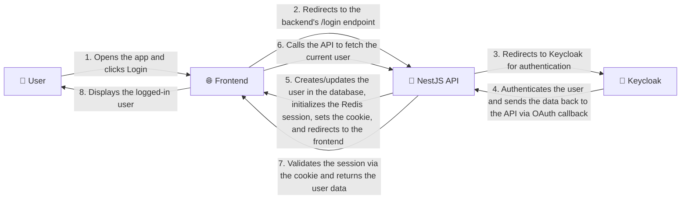
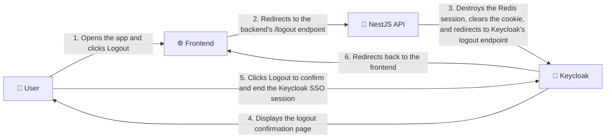

# OIDC avec NestJS et Keycloak

---

## Architecture

### Login

```mermaid
flowchart LR
    U[👤 User]
    FE[🌐 Frontend]
    KC[🔐 Keycloak]
    API[🚀 NestJS API]

    U -->|1. Opens the app and clicks Login | FE
    FE -->|2. Redirects to the backend's /login endpoint| API
    API -->|3. Redirects to Keycloak for authentication| KC
    KC -->|4. Authenticates the user and sends the data back to the API via OAuth callback| API
    API -->|5. Creates/updates the user in the database, initializes the Redis session, sets the cookie, and redirects to the frontend| FE
    FE -->|6. Calls the API to fetch the current user| API
    API -->|7. Validates the session via the cookie and returns the user data| FE
    FE -->|8. Displays the logged-in user| U
```

### Logout

```mermaid
flowchart LR
    U[👤 User]
    FE[🌐 Frontend]
    KC[🔐 Keycloak]
    API[🚀 NestJS API]

    U -->|1. Opens the app and clicks Logout | FE
    FE -->|2. Redirects to the backend's /logout endpoint| API
    API -->|3. Destroys the Redis session, clears the cookie, and redirects to Keycloak's logout endpoint| KC
    KC -->|4. Displays the logout confirmation page| U
    U -->|5. Clicks Logout to confirm and end the Keycloak SSO session| KC
    KC -->|6. Redirects back to the frontend| FE
```
